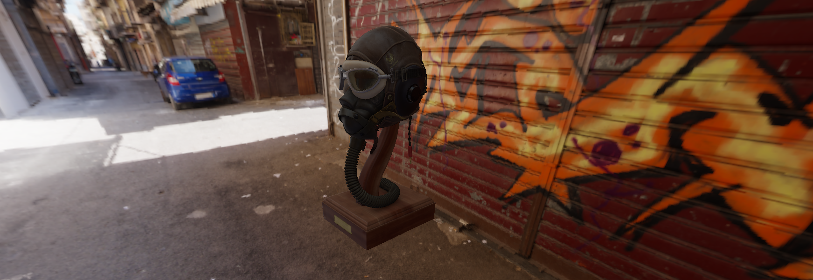

# Demo

- [https://stefanygeraldine.github.io/threejs-envoirement-map/](https://stefanygeraldine.github.io/threejs-envoirement-map/)

# Three.js Environment Map Practice

This project is a practice exercise using Three.js to create and implement an environment map. The environment map technique is often used to add realistic reflections and refractions to 3D objects in a scene, enhancing the overall visual quality and realism.

## Table of Contents

- [Introduction](#introduction)
- [Features](#features)

## Introduction

The purpose of this project is to practice and demonstrate the use of environment maps in Three.js. An environment map is a technique used in 3D graphics to simulate reflections on surfaces. By mapping a texture onto the scene's background, objects can reflect their surroundings, making them appear more realistic.

## Features

- Set up a basic Three.js scene with a camera and renderer.
- Create a cube map texture to be used as the environment map.
- Apply the environment map to various materials and geometries.
- Enable reflections and refractions on 3D objects.
- Interactive controls to explore the scene and observe the effects of the environment map.
